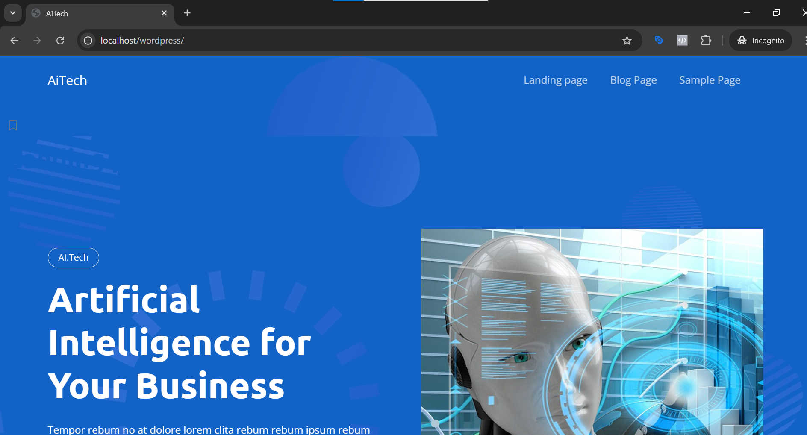

# aitech – A Bootstrap 5 Starter Theme, for WordPress

*Version 1.0.3*

[https://github.com/zenithcoder/aitech](https://github.com/zenithcoder/aitech)

------------------

> aitech is a simple, Gutenberg-compatible WordPress starter theme loaded with Bootstrap 5

## Screenshot

Here’s a screenshot of the project in action:

## Basic features

* [UNLICENCE](http://unlicense.org) (open source).

* Simple, intuitive, clean code. Theme CSS and JS, functions and loops are organized into different folders.

* A starter CSS theme, enqueued. (Note: do not put your styles in `styles.css`, because that is not enqueued.)

* A starter JS script.

* Dimox breadcrumbs ([http://dimox.net/wordpress-breadcrumbs-without-a-plugin/](http://dimox.net/wordpress-breadcrumbs-without-a-plugin/)). Inserted using an action hook.

## Dependencies

* WordPress. 😎

* Served from a CDN:
  * Bootstrap v5.2.3 CSS
  * Bootstrap v5.2.3 _bundle_ JS
  * Bootstrap Icons v1.10.2

**Bootstrap Sass is not included.** But you can follow the instructions at [https://getbootstrap.com/docs/5.0/customize/sass/](https://getbootstrap.com/docs/5.0/customize/sass/) to bring Bootstrap Sass into your project.

## Bootstrap Integration

* Bootstrap navbar with WordPress menu and search.
	* Navbar dropdowns (child menus) are handled by a [custom walker nav menu class](https://github.com/SimonPadbury/aitech/blob/master/functions/navbar.php).

* Bootstrap customized comments and feedback response form.

## Gutenberg Compatibility

* Gutenberg editor stylesheet – into which has been copy-pasted the typography styles from Bootstrap 5’s _Reboot_ CSS plus a few extras.

* aitech has a centered narrow single-column layout, so that it can make use of Gutenberg’s extra-wide and full width blocks. In the front-end CSS, these are handled by a variation on Andy Bell’s [full bleed](https://hankchizljaw.com/wrote/creating-a-full-bleed-css-utility/) utility.

## Child-Themes and aitech

_I recommend you do not simply use aitech as-is, and then do all your designing in a child theme._

aitech is only a meant to be a place to start a WordPress/Bootstrap 5 project. It is easier and better to directly rebuild aitech to suit your design needs. Besides, future improvements to aitech may make it not compatible with your child theme -- so, you may not be able to “upgrade” your project to a newer version of aitech simply by swapping it out.

To aid you at that point, aitech has the following child-theme friendly features:

* Many functions are pluggable.

* Theme [hooks](/functions/hooks.php) – paired _before_ and _after_ the navbar, post/page main, (optional sidebar) and footer. Parent theme hooks are able to recieve [actions](https://developer.wordpress.org/plugins/hooks/actions/) from a child theme.

* Also, the navbar brand, navbar search form and sub-footer “bottomline” are inserted using pluggable hooks. So, a child theme can override these.

---

See the [LOG.md](/LOG.md)
